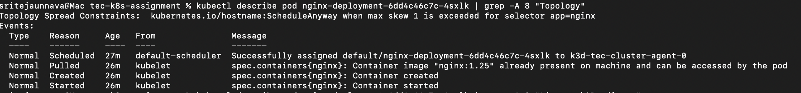
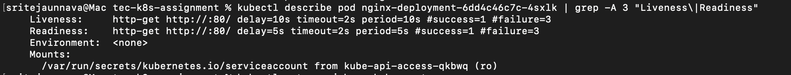
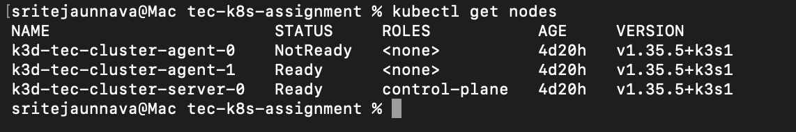
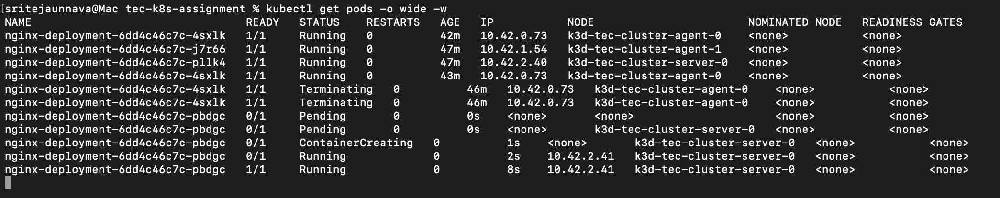
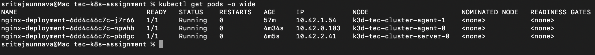

# TEC Kubernetes Assignment

## Overview

This project deploys a production-like Kubernetes cluster locally using k3d,
with a stateless nginx web application configured for high availability,
automatic failover, and full observability.

The setup demonstrates core Kubernetes engineering practices including
pod scheduling guarantees, self-healing deployments, health checks,
metrics collection, log aggregation, and node failure recovery.

## Assignment Tasks Covered

- Multi-node cluster: 1 control plane + 2 worker nodes using k3d
- Application deployment: nginx with 3 replicas, RollingUpdate strategy, LoadBalancer Service
- Pod spreading: topologySpreadConstraints across kubernetes.io/hostname
- Health checks: liveness and readiness probes on every container
- Monitoring: kube-prometheus-stack with two custom alert rules
- Log aggregation: Loki and Grafana Alloy with Grafana Explore verification
- Automatic failover: node failure simulated, traffic remained available, and replacement pod scheduling verified

## Repository Structure

```
tec-k8s-assignment/
├── setup.sh          # One-command cluster setup
├── teardown.sh       # One-command cluster teardown
├── cluster/          # Cluster setup documentation
├── manifests/        # Kubernetes deployment and service manifests
├── monitoring/       # Prometheus, Loki, and Alloy configuration
├── docs/             # Phase documentation
└── screenshots/      # Evidence for each phase
```

## Architecture


### Key Design Decisions

k3d was chosen over minikube and kind because it runs Kubernetes nodes
as Docker containers rather than VMs, making it significantly lighter
on resources. It also has native ARM support and spins up in under a minute.

All monitoring components run in a dedicated monitoring namespace, isolated
from the application in the default namespace. This mirrors production
practice for RBAC and resource management.

Note: In this local k3d setup, the server node is schedulable and runs
application workloads. In production, application pods would run exclusively
on worker nodes, with the control plane isolated using taints and tolerations.

## Cluster Setup

Tool: k3d v5.9.0
Nodes: 1 control plane + 2 worker nodes

### Command

```bash
k3d cluster create tec-cluster \
  --agents 2 \
  --k3s-arg "--disable=traefik@server:0" \
  --port "8080:80@loadbalancer"
```

### Verified

All 3 nodes confirmed Ready via kubectl get nodes.


### High Availability Note

This setup runs a single control plane node, which is not HA.
In production, HA requires a minimum of 3 control plane nodes.
etcd uses the Raft consensus algorithm and needs an odd number
of nodes for quorum. With 3 nodes, losing 1 still leaves 2 able
to agree on cluster state. Managed services like EKS handle this
automatically across availability zones without any manual configuration.

## Application Deployment

Tool: nginx:1.25
Replicas: 3, spread across all nodes via topologySpreadConstraints

### Deployment Strategy

RollingUpdate was chosen over Recreate to ensure zero downtime during
updates. maxSurge: 1 allows one extra pod during rollout. maxUnavailable: 1
means at minimum 2 pods are always serving traffic during an update.

Recreate is generally avoided for user-facing stateless web applications
because it can cause downtime. RollingUpdate is preferred when continuous
availability is required.

### Pod Spreading

topologySpreadConstraints were used to spread nginx replicas across nodes
using the kubernetes.io/hostname topology key. maxSkew: 1 encourages an
even distribution of pods across nodes during normal operation.
whenUnsatisfiable: ScheduleAnyway was selected so the scheduler can still
place replacement pods on surviving nodes during failure conditions without
leaving them Pending.




### Service

A LoadBalancer Service exposes nginx on localhost:8080. The selector
app: nginx routes traffic to all 3 pods automatically.


## Health Checks

Both liveness and readiness probes are configured on every nginx container.
All probe fields are explicitly defined to show intent rather than relying
on defaults.

### Liveness Probe

Checks if the container is alive and functioning. If it fails, Kubernetes
restarts the container. Configured with initialDelaySeconds: 10 to prevent
killing a container that is still starting up.

### Readiness Probe

Checks if the container is ready to serve traffic. If it fails, the pod
is removed from Service endpoints without restarting. Configured with
initialDelaySeconds: 5 to detect readiness as quickly as possible.

Both probes use HTTP GET on port 80 with timeoutSeconds: 2,
failureThreshold: 3, and successThreshold: 1 explicitly defined.

A preStop lifecycle hook sleeps 5 seconds before container shutdown,
giving the Service time to remove the pod from endpoints before traffic
stops flowing. terminationGracePeriodSeconds: 30 allows in-flight
requests to complete before the container is killed.



## Observability

### Monitoring Stack

Installed via Helm in the monitoring namespace.

| Component | Purpose |
|-----------|---------|
| Prometheus | Metrics collection and storage |
| Grafana | Visualization and dashboards |
| Alertmanager | Alert routing and notification |
| Loki | Log aggregation and storage |
| Grafana Alloy | Log collection from all pods |
| Kubernetes Descheduler | Automatic pod rebalancing after node recovery |

### Why kube-prometheus-stack

Installs Prometheus, Grafana, Alertmanager, node exporters, and
kube-state-metrics in a single Helm chart. It is a commonly used
production-grade monitoring stack for Kubernetes. A custom values
file was used to reduce resource usage for local deployment.

### Why Grafana Alloy Instead of Promtail

The assignment suggested Loki and Promtail. Promtail reached end of
life on March 2, 2026. Grafana Alloy is the current recommended
replacement for log collection with Loki. Alloy runs as a DaemonSet
with one pod per node, attaches Kubernetes metadata labels to every
log line, and ships logs to Loki automatically.

### Grafana Credentials

The Grafana admin password is stored in a Kubernetes Secret rather
than hardcoded in the values file. The Secret is referenced in the
Helm values using existingSecret.

```bash
kubectl create secret generic grafana-admin-secret \
  --namespace monitoring \
  --from-literal=admin-user=admin \
  --from-literal=admin-password=<your-password>
```

### Custom Alert Rules

Two custom PrometheusRule resources were created:

NodeNotReady: fires when a node has been NotReady for more than 1 minute.
Uses kube_node_status_condition metric. Severity: critical.

PodRestartingTooMuch: fires when a pod restarts more than 5 times in
15 minutes. Uses rate() on kube_pod_container_status_restarts_total.
Severity: warning.


### Log Verification

Logs verified two ways:

1. Grafana Explore view using LogQL query {namespace="default"} shows
nginx access logs with full Kubernetes metadata labels.

2. kubectl logs aggregation across all pods simultaneously:

```bash
kubectl logs -l app=nginx --all-containers=true --prefix=true
```


## Automatic Failover

### Method

Node failure simulated using k3d node stop, which stops the Docker
container acting as the worker node. A continuous curl loop ran
against localhost:8080 throughout the entire event.

### Sequence

1. Baseline: 3 nodes Ready, 3 pods Running, curl returning HTTP 200
2. Node stopped: one worker moved to NotReady
3. Traffic behavior: curl continued returning HTTP 200 through remaining pods
4. Self-healing: Deployment created a replacement pod immediately
5. Scheduling: replacement pod scheduled on an available node because
   topologySpreadConstraints used ScheduleAnyway
6. Brief interruption: approximately 3-5 seconds of connection failures
   during abrupt node loss due to endpoint propagation delay
7. Recovery: failed node started again and returned to Ready
8. Final state: deployment returned to 3 replicas, one per node

### Note on Brief Connection Failures

A brief interruption of approximately 3-5 seconds was observed during
the node failure. This is expected behavior during abrupt node loss.
The preStop hook reduces this window during graceful termination but
cannot prevent it during sudden node failure. The Service endpoint
controller requires time to detect the pod is gone and update routing.

### Note on Eviction Timeout

The default node eviction timeout is 5 minutes. This is intentional.
Kubernetes does not immediately reschedule pods when a node goes down
because the outage could be a brief network blip. In production the
correct approach for planned maintenance is kubectl cordon and
kubectl drain which evicts pods immediately and gracefully.








## Future Improvements

The following improvements represent natural next steps for a
production deployment:

- HA control plane with 3 nodes and external etcd cluster
- Horizontal Pod Autoscaler based on CPU utilisation
- Cluster Autoscaler or Karpenter for automatic node provisioning
- Ingress controller with TLS termination via cert-manager
- RBAC with least-privilege service accounts per namespace
- Network policies to restrict pod-to-pod traffic
- Persistent storage for Prometheus and Loki using PVCs
- Image scanning in CI pipeline before deployment
- Pod Disruption Budgets to control voluntary disruptions
- Multi-environment setup with dev, staging, and production namespaces

## How to Reproduce

### Prerequisites

- Docker Desktop running
- k3d, kubectl, and Helm installed

### Steps

```bash
./setup.sh
```

This script handles all installation steps automatically including cluster creation,
nginx deployment, monitoring stack, log aggregation, and the Descheduler.

nginx accessible at http://localhost:8080

Grafana accessible via port-forward:
```bash
kubectl --namespace monitoring port-forward svc/kube-prometheus-stack-grafana 3000:80
```
Then open http://localhost:3000 (admin / Tec@Local2026)

### Teardown

To remove the entire cluster:
```bash
./teardown.sh
```
