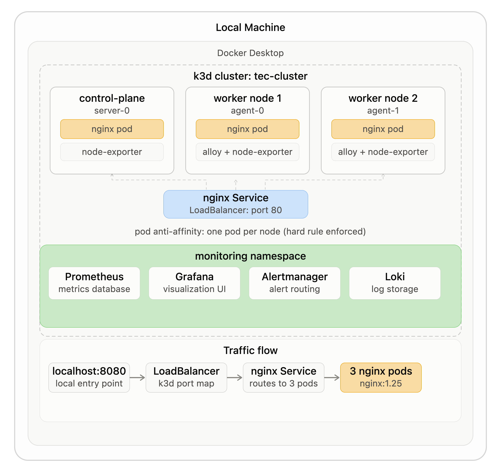
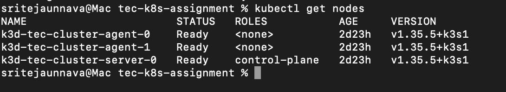

# TEC Kubernetes Assignment

## Overview

This project deploys a production-like Kubernetes cluster locally using k3d,
with a stateless nginx web application configured for high availability,
automatic failover, and full observability.

The setup demonstrates core Kubernetes engineering practices including
pod scheduling guarantees, self-healing deployments, health checks,
metrics collection, log aggregation, and node failure recovery.

## Repository Structure

```
tec-k8s-assignment/
├── cluster/          # Cluster setup documentation
├── manifests/        # Kubernetes deployment and service manifests
├── monitoring/       # Prometheus, Loki, and Alloy configuration
├── docs/             # Phase documentation
└── screenshots/      # Evidence for each phase
```
## Architecture



### Key Design Decisions

k3d was chosen over minikube and kind because it runs Kubernetes nodes
as Docker containers rather than VMs, making it significantly lighter
on resources. It also has native ARM support and spins up in under a minute.

All monitoring components run in a dedicated monitoring namespace, isolated
from the application in the default namespace. This mirrors production
practice for RBAC and resource management.

## Cluster Setup

Tool: k3d v5.9.0
Nodes: 1 control plane + 2 worker nodes

### Command

```bash
k3d cluster create tec-cluster \
  --agents 2 \
  --k3s-arg "--disable=traefik@server:0" \
  --port "8080:80@loadbalancer"
```

### Verified

All 3 nodes confirmed Ready via kubectl get nodes.



### High Availability Note

This setup runs a single control plane node, which is not HA.
In production, HA requires a minimum of 3 control plane nodes.
etcd uses the Raft consensus algorithm and needs an odd number
of nodes for quorum. With 3 nodes, losing 1 still leaves 2 able
to agree on cluster state. Managed services like EKS handle this
automatically across availability zones without any manual configuration.
