# TEC Kubernetes Assignment

## Overview

This project deploys a production-like Kubernetes cluster locally using k3d,
with a stateless nginx web application configured for high availability,
automatic failover, and full observability.

The setup demonstrates core Kubernetes engineering practices including
pod scheduling guarantees, self-healing deployments, health checks,
metrics collection, log aggregation, and node failure recovery.

## Repository Structure

```
tec-k8s-assignment/
├── cluster/          # Cluster setup documentation
├── manifests/        # Kubernetes deployment and service manifests
├── monitoring/       # Prometheus, Loki, and Alloy configuration
├── docs/             # Phase documentation
└── screenshots/      # Evidence for each phase
```
## Architecture


### Key Design Decisions

k3d was chosen over minikube and kind because it runs Kubernetes nodes
as Docker containers rather than VMs, making it significantly lighter
on resources. It also has native ARM support and spins up in under a minute.

All monitoring components run in a dedicated monitoring namespace, isolated
from the application in the default namespace. This mirrors production
practice for RBAC and resource management.

## Cluster Setup

Tool: k3d v5.9.0
Nodes: 1 control plane + 2 worker nodes

### Command

```bash
k3d cluster create tec-cluster \
  --agents 2 \
  --k3s-arg "--disable=traefik@server:0" \
  --port "8080:80@loadbalancer"
```

### Verified

All 3 nodes confirmed Ready via kubectl get nodes.


### High Availability Note

This setup runs a single control plane node, which is not HA.
In production, HA requires a minimum of 3 control plane nodes.
etcd uses the Raft consensus algorithm and needs an odd number
of nodes for quorum. With 3 nodes, losing 1 still leaves 2 able
to agree on cluster state. Managed services like EKS handle this
automatically across availability zones without any manual configuration.

## Application Deployment

Tool: nginx:1.25
Replicas: 3, spread across all nodes via pod anti-affinity

### Deployment Strategy

RollingUpdate was chosen over Recreate to ensure zero downtime during
updates. maxSurge: 1 allows one extra pod during rollout. maxUnavailable: 1
means at minimum 2 pods are always serving traffic during an update.

### Pod Anti-Affinity

A hard anti-affinity rule guarantees one nginx pod per node. Without this,
the scheduler spreads pods by default but does not guarantee it. The rule
uses requiredDuringSchedulingIgnoredDuringExecution with topologyKey
kubernetes.io/hostname, meaning the scheduler will not place a pod on a
node that already has an nginx pod running.

Proof of enforcement: kubectl describe pod showed FailedScheduling events
confirming the scheduler evaluated and enforced the rule before placement.

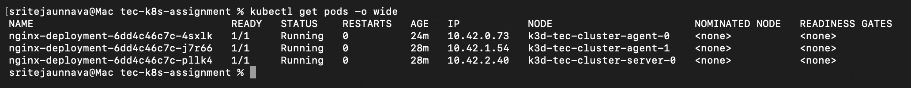

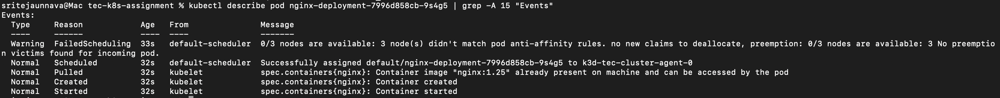

### Service

A LoadBalancer Service exposes nginx on localhost:8080. The selector
app: nginx routes traffic to all 3 pods automatically.

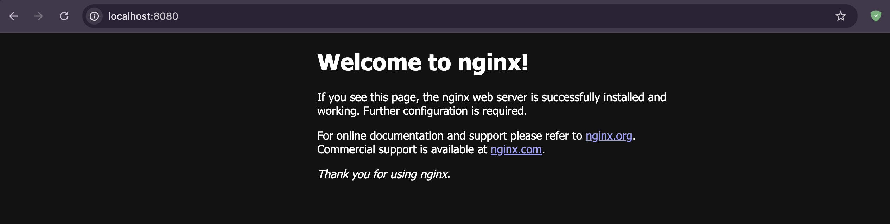

## Health Checks

Both liveness and readiness probes are configured on every nginx container.

### Liveness Probe

Checks if the container is alive and functioning. If it fails, Kubernetes
restarts the container. Configured with initialDelaySeconds: 10 to prevent
killing a container that is still starting up.

### Readiness Probe

Checks if the container is ready to serve traffic. If it fails, the pod
is removed from Service endpoints without restarting. Configured with
initialDelaySeconds: 5 to detect readiness as quickly as possible.

Both probes use HTTP GET on port 80 with failureThreshold: 3 to avoid
action on a single slow response.

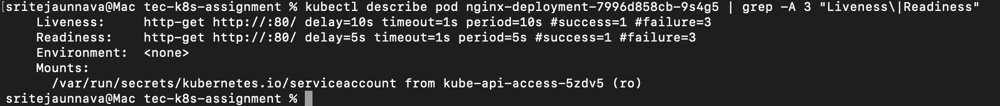

## Observability

### Monitoring Stack

Installed via Helm in the monitoring namespace.

| Component | Purpose |
|-----------|---------|
| Prometheus | Metrics collection and storage |
| Grafana | Visualization and dashboards |
| Alertmanager | Alert routing and notification |
| Loki | Log aggregation and storage |
| Grafana Alloy | Log collection from all pods |

### Why kube-prometheus-stack

Installs Prometheus, Grafana, Alertmanager, node exporters, and
kube-state-metrics in a single Helm chart. This is the production
standard for Kubernetes monitoring. A custom values file was used
to reduce resource usage for local deployment.

### Why Grafana Alloy Instead of Promtail

The assignment suggested Loki + Promtail. Promtail reached end of
life on March 2, 2026. Grafana Alloy is the current recommended
replacement for log collection with Loki. Alloy runs as a DaemonSet
with one pod per node, attaches Kubernetes metadata labels to every
log line, and ships logs to Loki automatically.

### Custom Alert Rules

Two custom PrometheusRule resources were created:

NodeNotReady: fires when a node has been NotReady for more than 1 minute.
Uses kube_node_status_condition metric. Severity: critical.

PodRestartingTooMuch: fires when a pod restarts more than 5 times in
15 minutes. Uses rate() on kube_pod_container_status_restarts_total.
Severity: warning.

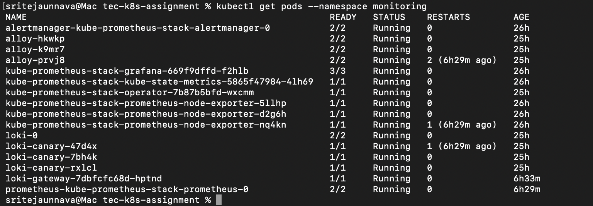

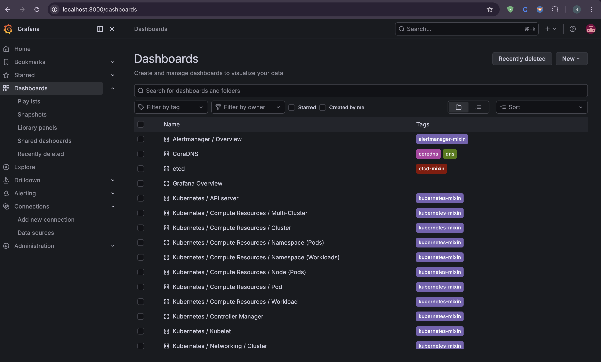

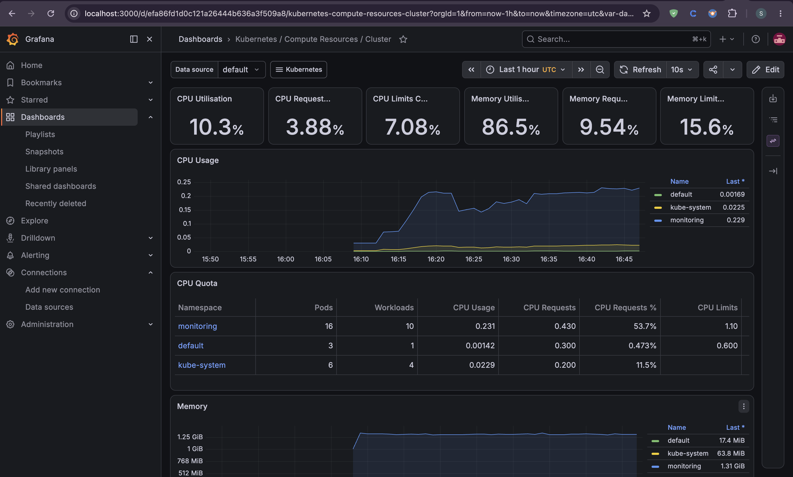

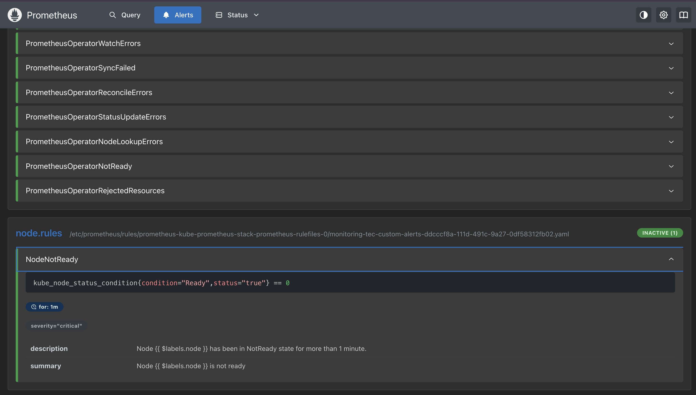

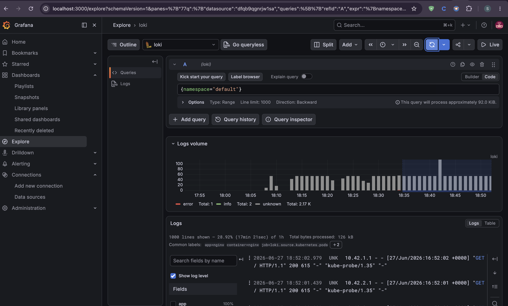

### Log Verification

Logs verified two ways:

1. Grafana Explore view using LogQL query {namespace="default"} shows
nginx access logs with full Kubernetes metadata labels.

2. kubectl logs aggregation across all pods simultaneously:

```bash
kubectl logs -l app=nginx --all-containers=true --prefix=true
```

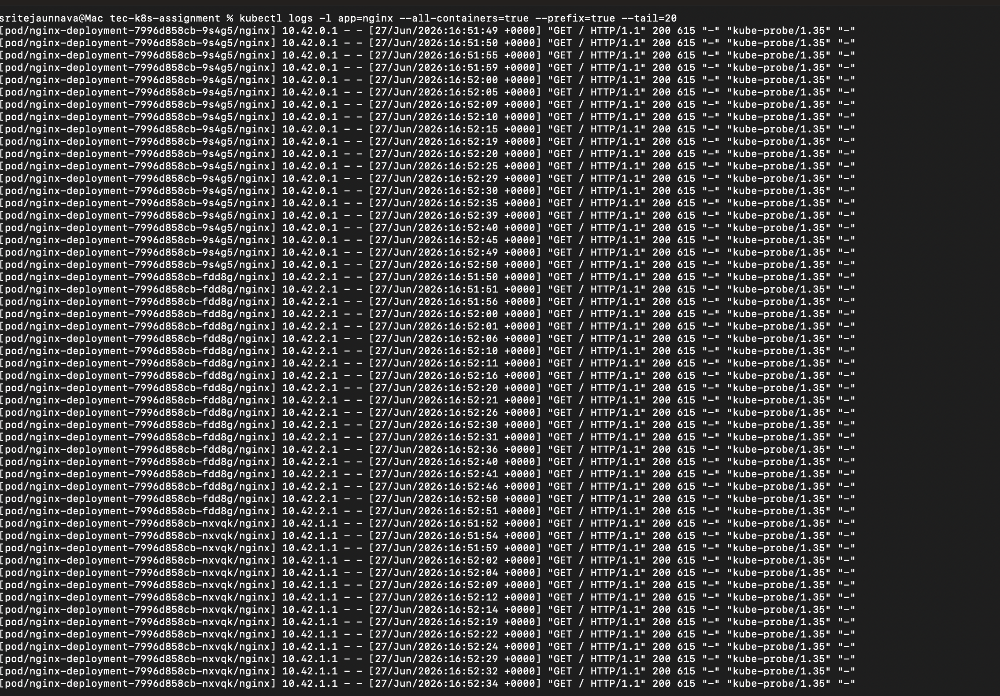

## Automatic Failover

### Method

Node failure simulated using k3d node stop, which stops the Docker
container acting as the worker node. This is equivalent to a server
losing power or network connectivity.

### Sequence

A continuous curl loop ran against localhost:8080 throughout the
entire event to prove nginx remained available.

1. Baseline: 3 nodes Ready, 3 pods Running, curl returning 200
2. Node stopped: k3d-tec-cluster-agent-0 moved to NotReady
3. Self-healing: Deployment controller immediately created a replacement pod
4. Anti-affinity held: replacement stayed Pending until a valid node was available
5. Recovery: node restarted, replacement pod scheduled and Running within seconds
6. Full recovery: 3 nodes Ready, 3 pods Running, curl never dropped

### Key Observation

nginx continued serving HTTP 200 throughout the entire event from
the two surviving pods. The replacement pod stayed Pending rather
than violating the anti-affinity constraint. The moment the node
recovered, the pod scheduled immediately.

In production this Pending period would not occur because production
clusters run more nodes than replicas. Cluster Autoscaler would also
provision a new node automatically if pods remained Pending.

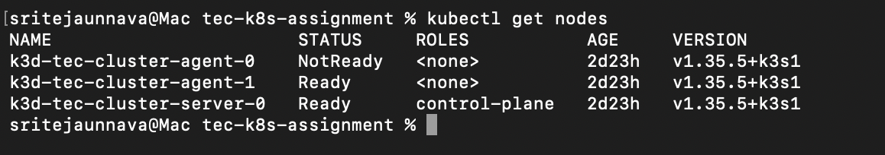

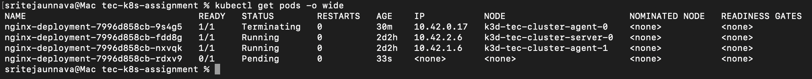

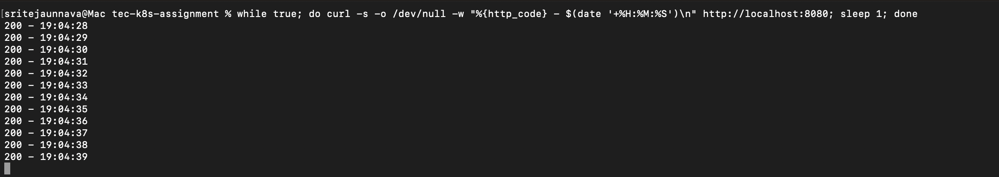

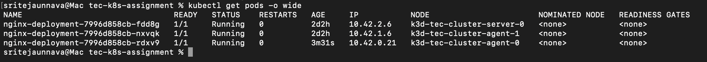

## Future Improvements

The following improvements represent natural next steps for a
production deployment:

- HA control plane with 3 nodes and external etcd cluster
- Horizontal Pod Autoscaler based on CPU utilisation
- Cluster Autoscaler or Karpenter for automatic node provisioning
- TLS termination via Ingress controller with cert-manager
- RBAC with least-privilege service accounts per namespace
- Network policies to restrict pod-to-pod traffic
- Persistent storage for Prometheus and Loki using PVCs
- Secrets management via Vault or AWS Secrets Manager
- Image scanning in CI pipeline before deployment
- Pod Disruption Budgets to control voluntary disruptions

## How to Reproduce

### Prerequisites

- Docker Desktop running
- k3d, kubectl, and Helm installed

### Steps

```bash
k3d cluster create tec-cluster \
  --agents 2 \
  --k3s-arg "--disable=traefik@server:0" \
  --port "8080:80@loadbalancer"

kubectl apply -f manifests/deployment.yaml
kubectl apply -f manifests/service.yaml

helm install kube-prometheus-stack prometheus-community/kube-prometheus-stack \
  --namespace monitoring \
  --values monitoring/prometheus-values.yaml

kubectl apply -f monitoring/alert-rules.yaml

helm install loki grafana/loki \
  --namespace monitoring \
  --values monitoring/loki-values.yaml

helm install alloy grafana/alloy \
  --namespace monitoring \
  --values monitoring/alloy-values.yaml
```

nginx accessible at http://localhost:8080
Grafana accessible via port-forward at http://localhost:3000